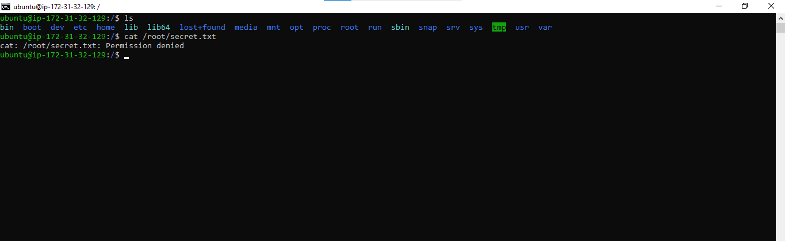
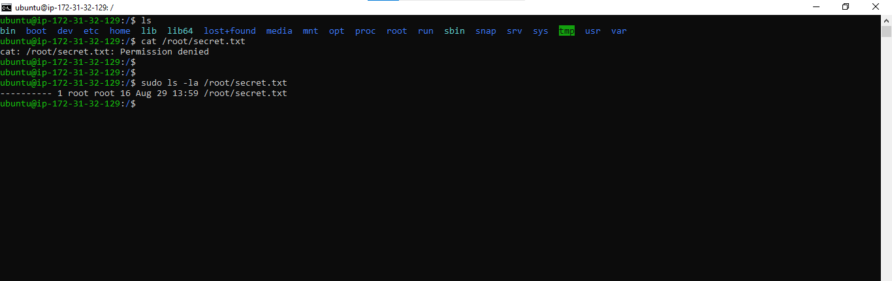
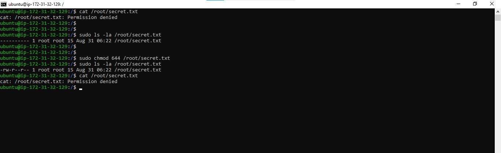
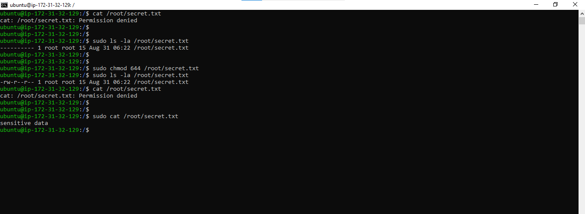
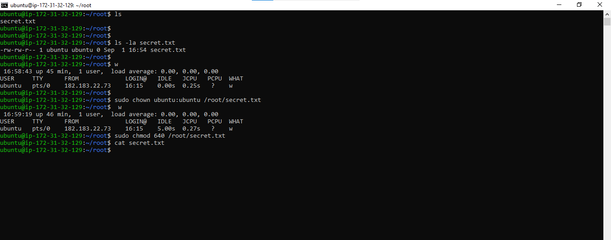
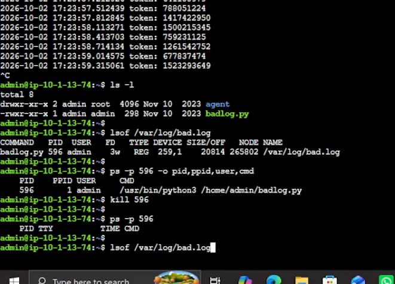
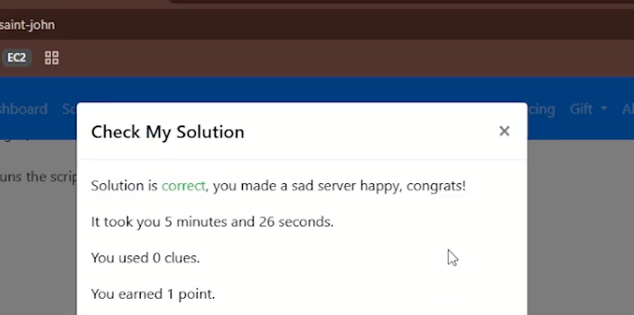

<<<<<<< HEAD
A file named `/root/secret.txt` contains sensitive data that needs to be accessed by the `ubuntu` user. However, the user receives a permission error when attempting to read the file.

**Evidence**

*.*

---

## Diagnosis

To investigate the issue, we have to check the current file permissions using:

```bash
ls -la /root/secret.txt
```

**Output**

*.*

The output shows that the file permissions are set to `000`, meaning no user has read, write, or execute permissions on the file.

---

## Initial Resolution Attempt

The first step is to modify the file permissions so that the owner could read and write the file, while group members and others could read it.

```bash
sudo chmod 644 /root/secret.txt
```

Permission breakdown:

* Owner: Read + Write (`6`)
* Group: Read (`4`)
* Others: Read (`4`)

**Evidence**

*.*

---

## Additional Investigation

After changing the permissions to `644`, the `ubuntu` user was still unable to read the file.

This occurred because the file is located inside the `/root` directory. Even though the file itself is readable, normal users cannot access files inside `/root` because they do not have permission to traverse that directory.

To verify access, the file was opened using elevated privileges:

```bash
sudo cat /root/secret.txt
```

**Evidence**

*.*

---

## Alternative Solution: Change Ownership

If the file is intended to belong to the `ubuntu` user, ownership can be transferred using the `chown` command.

```bash
sudo chown ubuntu:ubuntu /root/secret.txt
sudo chmod 640 /root/secret.txt
```

Permission breakdown:

* Owner: Read + Write (`6`)
* Group: Read (`4`)
* Others: No permissions (`0`)

**Evidence**

*.*

---

## Root Cause

The issue was caused by two separate permission restrictions:

1. The file permissions were set to `000`, preventing any access.
2. The file was stored inside the `/root` directory, which normal users cannot access without having higher-level access rights than a standard user
and changing the file permissions alone was not sufficient because directory permissions also affect file accessibility.

---

## Key Concepts I Demonstrated

### 1. chmod (Change Mode)

The `chmod` command modifies file permissions using octal notation.

| Value | Permission  |
| ----- | ----------- |
| 4     | Read (r)    |
| 2     | Write (w)   |
| 1     | Execute (x) |

Examples:

* `644` = Read/Write, Read, Read
* `640` = Read/Write, Read, None
* `000` = No permissions

### 2. chown (Change Owner)

The `chown` command transfers file ownership to another user or group.

Example:

```bash
sudo chown ubuntu:ubuntu /root/secret.txt
```

### 3. Permission Categories

Linux permissions are divided into three categories:

* **Owner** (first digit)
* **Group** (second digit)
* **Others** (third digit)

### 4. Directory Permissions Matter

File permissions alone do not guarantee access. Users must also have permission to traverse the parent directory containing the file.

---

## Skills Demonstrated

* Linux file permission troubleshooting
* Permission analysis using `ls -la`
* Access control using `chmod`
* Ownership management using `chown`
* Understanding of directory traversal permissions
* Root cause analysis and verification

=======
# SadServers: "Saint John"

---

## 1. The Problem

A developer made a test program. The program keeps writing to this file:

```
/var/log/bad.log
``` 

The log file keeps growing. It is filling up the disk. Nobody needs this program anymore.

**My task:** Find the process that writes to the log file, and stop it.

---

## 2. Steps I Took

### Step 1: Confirm the problem

I watched the log file to see the new lines.

```bash
tail -f /var/log/bad.log
```

**What I saw:**

```
*.*
```

New lines kept coming. This confirmed the problem.

---

### Step 2: Look around

I checked the files in my home folder.

```bash
ls -l
```

**What I saw:**

```
*.*
```

I found a Python file called `badlog.py`. It looked like the program that makes the logs.

---

### Step 3: Find the process that writes to the file

I did **not** just delete `badlog.py`. Deleting a file does not stop a program that is already running. So I used `lsof` ("list open files") to see who has the log file open.

```bash
lsof /var/log/bad.log
```

**What I saw:**

```
*.*
```

From this output, I got the **PID** (process ID) of the program.

---

### Step 4: Check the process

I checked the process before I killed it. I wanted to be sure it was the right one.

```bash
ps -p <PID> -o pid,ppid,user,cmd
```

**What I saw:**

```
*.*
```

It was the `badlog.py` script. This was the right process.

---

### Step 5: Stop the process

```bash
kill <PID>
```
*.*
---

 ### Step 6: Check that it worked

I checked three things:

```bash
# 1. Is the process gone?
ps -p <PID>

# 2. Does anyone still have the file open?
lsof /var/log/bad.log

# 3. Run the scenario check
./check.sh
```

**What I saw:**

```
*.*

```

The file stopped growing. The check passed.

---

## 3. Root Cause

A test script (`badlog.py`) was still running in the background. It wrote to `/var/log/bad.log` all the time and never stopped. Nobody rotated or limited the log, so it filled the disk.

---

## 4. Key Lessons

- **Deleting a file does not stop a running program.** The program lives in memory. It keeps running after you delete the script.
- **Deleting the log file does not help.** The program can create it again and keep writing.
- **`lsof` is the fastest way to find who uses a file.**
- **Always check a process before you kill it.** Use `ps` first.

---

## 6. Commands Used

| Command   | What it does |
|---------  |--------------|
| `tail -f` | Shows new lines of a file as they are added |
| `ls -l`   | Lists files with details |
| `lsof <file>` | Shows which processes have a file open |
| `ps -p <PID>` | Shows details about one process |
| `kill <PID>` | Asks a process to stop |
| `kill -9 <PID>` | Forces a process to stop |

---

## 7. How I Would Prevent This in Real Life

- Use **logrotate** to limit the size of log files.
- Set **disk usage alerts** (for example at 80%).
- Do not leave test programs running on a server.
- Run programs as **systemd services** so they are easy to find, stop, and limit.

---

## 8. Time Taken

*.*
>>>>>>> 89ffe59 (Process troubleshooting docs)
