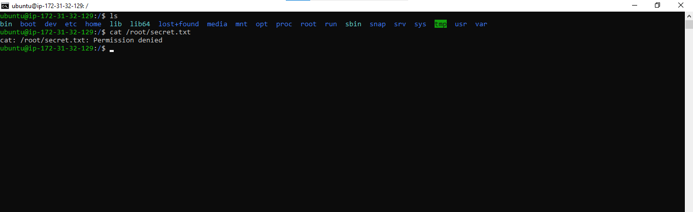
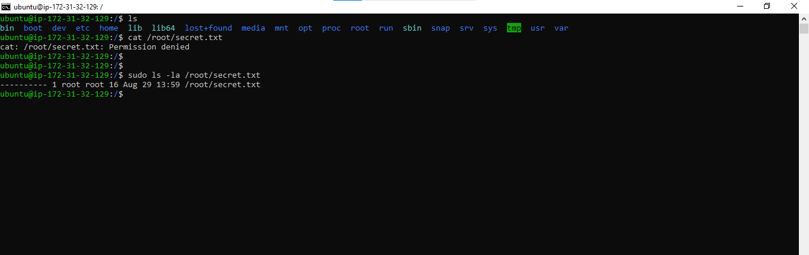
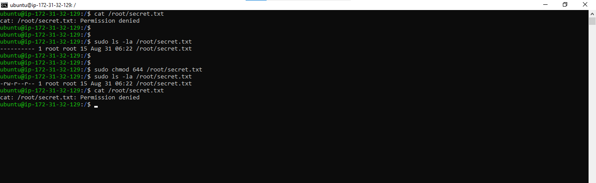
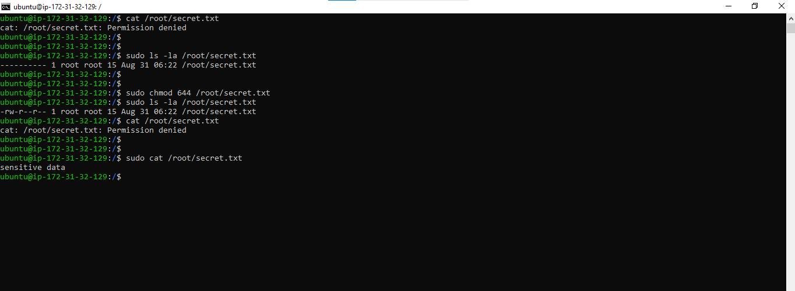
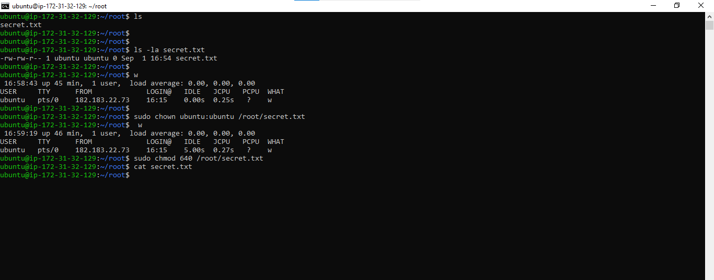

A file named `/root/secret.txt` contains sensitive data that needs to be accessed by the `ubuntu` user. However, the user receives a permission error when attempting to read the file.

**Evidence**

*.*

---

## Diagnosis

To investigate the issue, we have to check the current file permissions using:

```bash
ls -la /root/secret.txt
```

**Output**

*.*

The output shows that the file permissions are set to `000`, meaning no user has read, write, or execute permissions on the file.

---

## Initial Resolution Attempt

The first step is to modify the file permissions so that the owner could read and write the file, while group members and others could read it.

```bash
sudo chmod 644 /root/secret.txt
```

Permission breakdown:

* Owner: Read + Write (`6`)
* Group: Read (`4`)
* Others: Read (`4`)

**Evidence**

*.*

---

## Additional Investigation

After changing the permissions to `644`, the `ubuntu` user was still unable to read the file.

This occurred because the file is located inside the `/root` directory. Even though the file itself is readable, normal users cannot access files inside `/root` because they do not have permission to traverse that directory.

To verify access, the file was opened using elevated privileges:

```bash
sudo cat /root/secret.txt
```

**Evidence**

*.*

---

## Alternative Solution: Change Ownership

If the file is intended to belong to the `ubuntu` user, ownership can be transferred using the `chown` command.

```bash
sudo chown ubuntu:ubuntu /root/secret.txt
sudo chmod 640 /root/secret.txt
```

Permission breakdown:

* Owner: Read + Write (`6`)
* Group: Read (`4`)
* Others: No permissions (`0`)

**Evidence**

*.*

---

## Root Cause

The issue was caused by two separate permission restrictions:

1. The file permissions were set to `000`, preventing any access.
2. The file was stored inside the `/root` directory, which normal users cannot access without having higher-level access rights than a standard user
and changing the file permissions alone was not sufficient because directory permissions also affect file accessibility.

---

## Key Concepts I Demonstrated

### 1. chmod (Change Mode)

The `chmod` command modifies file permissions using octal notation.

| Value | Permission  |
| ----- | ----------- |
| 4     | Read (r)    |
| 2     | Write (w)   |
| 1     | Execute (x) |

Examples:

* `644` = Read/Write, Read, Read
* `640` = Read/Write, Read, None
* `000` = No permissions

### 2. chown (Change Owner)

The `chown` command transfers file ownership to another user or group.

Example:

```bash
sudo chown ubuntu:ubuntu /root/secret.txt
```

### 3. Permission Categories

Linux permissions are divided into three categories:

* **Owner** (first digit)
* **Group** (second digit)
* **Others** (third digit)

### 4. Directory Permissions Matter

File permissions alone do not guarantee access. Users must also have permission to traverse the parent directory containing the file.

---

## Skills Demonstrated

* Linux file permission troubleshooting
* Permission analysis using `ls -la`
* Access control using `chmod`
* Ownership management using `chown`
* Understanding of directory traversal permissions
* Root cause analysis and verification

